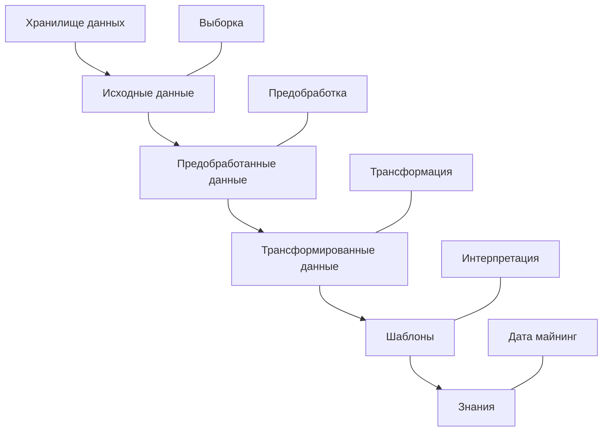
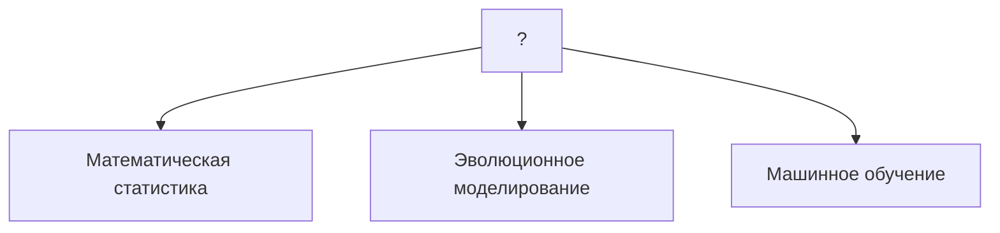
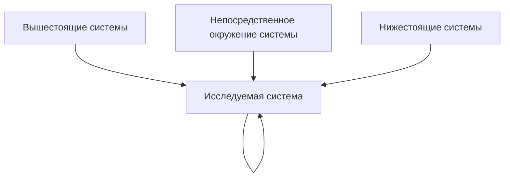

# Методологии информационно-аналитической работы
# Лекция 2. 
## Анализ данных
**Анализ данных** - исследования, связанные с обсчетом многомерной системы данных, имеющей множество параметров.

**Модель** - объект или описание объекта, системы для замещения оригинала другой системой для лучшего изучения. **Моделирование** - универсальный метод получения, описания и использования знаний.

Аналитик всегда выдвигает минимум 2 варианта развития событий - положительный и негативный

Свойства модели
- Упрощенность
- Конечность
- Приближенность
- Адекватность
- Целостность
- Замкнутость
- Управляемость

Подходы к моделированию - аналитический и информационный. При аналитическом подходе мы подбираем существующую модель так чтобы она отражала реальность. При информационном подходе имеются входные данные, и модель строится под эти данные. Мы в дальнейшем будем использовать информационный. 

## Хронология появления терминов
Knowledge Discovery in Databases (KDD) - процесс поиска полезных знаний в "сырых" данных. Основа процесса - методы data mining

**Data mining**
- Классификация
- Кластеризация
- Регрессия
-

Имеет много выгодных отличий от статистических методов, датамайнинг универсальный и пришел им на смену.

**Machine learning** - область науч знания, объект иссл  которой явл методы построения алгоритмов, способных обучаться на данных для прогнозов.

**Big data** - технология в области аппаратного и программного обеспечения, которая интегрирует, управляет и анализирует данные, определяется 4 характеристиками (4V) - объем (volume), разнообразие (variety), изменчивость (viscosity?), скорость (velocity).

**Predictive Analytics** - класс методов анализа данных, концентрирующийся на прогнозировании будущего поведения объектов и субъектов с целью принятия оптимальных решений.

**Искусственный интеллект** - обобщенный термин, сейчас в фокусе нейронные сети и глубокое обучение. Модель человеческого мозга использовалась.

**Deep Learning** - подкласс методов машинного обучения, где алгоритм сам находит признаки и структурирует иерархично, из более простых складываются более сложные.

- Обучение без учителя
- Обучение с частичным привлечением учителем
- Обучение с учителем

Термин андроид придуман писателем фантастом Айзеком Азимовым.

## Онтология анализа данных

## Обзор мирового рынка аналитических систем
**Аналитическая платформа** - специальное ПО или набор решений, которое содержит в себе все инструменты ддля извлечения закономерностей из "сырых" данных, обязательно визуализацию ...

Обычно строится по технологии low-code, чтобы больше пользователей могли работать. Но обычно можно модернизировать/оптимизировать/донастроить в коде.

**Квадрант Gartner** - шрафическое отображение ситуации на рынке, позволяющее оценить возможности продуктов и самих производителейю На основе оценки по ключевым параметрам вендоры разбиваются на 4 группы: лидеры, претенденты на лидерство, дальновидные и нишевые игроки.
| ^ | Претенденты на лидерство | Лидеры |
|--|--|--|
| Реализуемость | Нишевые игроки | Дальновидные игроки |
| решения | Полнота | видения > |

# Лекция 3
## Целеполагание
Если нам известен конечный результат - система **целеориентированная**. То есть мы хотим получить конкретный результат с конкретными значениями.

Рациональный потребитель расходует все доступные ему ресурсы. Иначе он не рациональный потребитель (с оговорками).

Система также является **рациональной**, если она максимально расходует все ресурсы для достижения цели.

Иммитационная модель пример - эксперименты с мышками.

Результат не известен; Т.е. хотим понять, к какому результату действия приведут - **ценностноориентированная** система.

Число конструктивных требований, определяющих цель системы, не может превышать число степеней свободы, => должно быть не больше числа параметров состояния.

**Область достижимости** - множество всех предельных состояний системы (множество состояний системы которого она достигает при наилучшем управлении)

Правила процедуры целеполагания
- лучше ограничиться незначительным числом существенных требований к системе
- чем выше значимостть достижения цели, тем менбше нужно принимать в расчет оптимистичные прогнозы
- 

Методика SMART
- **S**pecific, конкретность и ясность
- **M**easurable, измеряемость
- **A**chievable, достижимость
- **R**elevant, важность
- **T**ime bound, определенность по срокам

время можно определить к конкретной дате, в течение промежутка времени, к такому то событию.

## Декомпозиция: единство и обособленность анализа и синтеза в системных исследованиях
Значение **аналитического подхода** не только в том, что сложное целое расчленияется на все менее сложные и простые части, а в том, что будучи соединенными надлежащим образом, эти части снова образуют единое целое.

В рамках **синтетического подхода** исслежуется не структура, а функция системы. Его результаты должны ответить на вопрос, почему система ...

**Декомпозиция** - разделение целого на части, до тех пор, пока не станут простыми неделимыми элементами. Часто представляется в виде древовидной структуры.

объект - то, что делается
субъект - человек, который это делает
предмет - станок, на котором он это делает

Модель жизненного цикла системы
1) Начало
2) Развитие
3) Конец

**Принцип простоты** - сокращать модель системы
**Принцип полноты** - делать детальной

## Агрегирование и эмерджентность
**Аггрегирование** - операция, противоположная декомпозиции.

Внутренняя целостность системы - система имеет такие свойства, которых нет ни у одной из ее частей.

# Лекция 5
## Классификация видов моделей систем

По степени полноты 
- Полные
- Неполные
- Приближенные

По характеру изучаемых процессов
- Детерминированные и стохастические
- Статические и динамические
- Дискретные, непрерывные и дискретно-непрерывные

По форме представления объекта
- мысленные
-
- реальные
- 

## Классификация моделей
По области использования
- Учебные модели
- Опытные модели
- Научно-технические модели
- Игровые модели
- Имитационные модели

С учетом фактора времени
- Статические модели
- Динамические модели

По способу предстваления
- Материальные
- Информационные
    - Знаковые (слова, формулы или даже ноты, схемы, графики)
    - Вербальные (просто размышления)
    - Компьютерные
    - Некомпьютерные

По форме представления
- Словесные
- Геометрические
- Математические модели
- Структурные модели
- Логические модели
- Специальные модели

### Вербальные (понятийные) модели

Приведение (стандартизация) терминологии + сокращение избыточности описаний = 

### Логико-лингвистические модели
При построении логико-лингвистических моделей щироко используется симольный язык логики и формализм теории графов и алгоритмов

**Граф** - это формальная система, предназначенная для вырадения отношений между элементами произвольной природы, оперирующая объектами двух типов: вершина (точка), символизирующая элемент, и ребро (дуга, связь), символизирующее отношение между связываемыми элементами внутри системы.

**Сценарные модели (сценарии)** - это разновидность логико-лингвистических моделей, предназначенных для отображения развернутых во времени последовательностей взаимосвязанных состояний, операций или процессов.

**Семантическая сеть** - это разновидность модели, отображающая множество понятий и ...

### Логические модели
В логических моделях естественно-языковые высказывания замещаются на примитивные высказывания - литералы, между которыми устанавливаются отношения, предписываемые формальной логикой.

**Высказывание (литерал)** - языковое выражение, которое имеет смысл в рамках некоторой теории

**Логическая операция** - операция построения из одного или более высказываний нового высказывания.

**Силогизм** - это система логических формул, состоящая из двух исходных посылок (онтецедентов) и следствия (консеквента)

**Полисилогизм (сорит)** - вывод одного силогизма становится входом другого

### Статистическая (теоретико-вероятностная) модель
**Метод Монте-Карло** - метод численного решения математических задач, основанный на многократном теоретико-вероятностном и статистическиом моделировании случайных величин или процессов с целью построения статистических оценок для искомых величин.

### Аналитическое математическое моделирование
Это вид моделирования в ходе которого основная роль отводится аналитической математической модели.
### Иммитационная модель
Это комплексное логико-математические представление системы, реализованное в виде программы, предназначенной для вычисления на ЭВМ, включающее в себя модели различного типа, и рассматривающее аспект ....